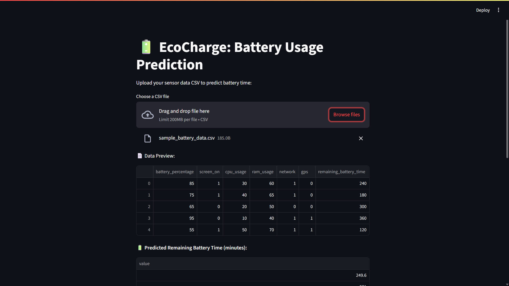
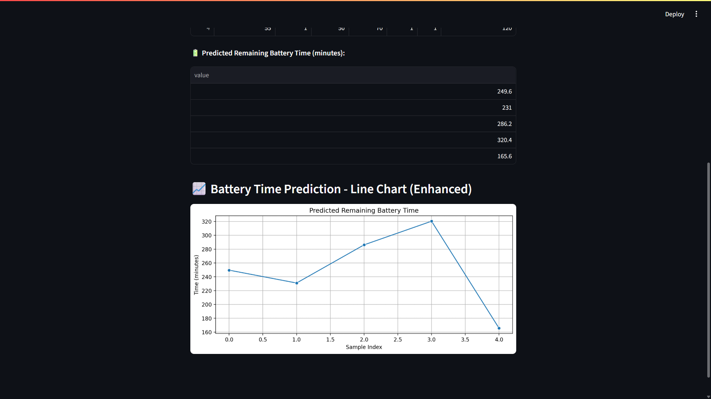

# EcoCharge: Battery Usage Prediction with Machine Learning 🚀🔋

Predicts remaining battery time and suggests optimizations using ML on smartphone data.

## Features
✅ Data preprocessing and cleaning  
✅ Regression models (Linear Regression, Random Forest, XGBoost)  
✅ Streamlit dashboard for displaying battery predictions  
✅ Clean, structured code for learning and showcasing on GitHub
✅ Upload your own CSV sensor dataset  
✅ Predict remaining battery life using a trained model  
✅ Visualize predictions using a live line chart  


## How to Run
1. Clone this repository.
2. Install dependencies: `pip install -r requirements.txt`
3. Run the notebook in `notebooks/` to train the model.
4. Run the dashboard:
```
streamlit run app/dashboard.py
```
## 🔍 Demo

# Deployed link:🌐 https://pradipd1echocharge.streamlit.app/

### 📈 Dashboard View


### 📊 Prediction Chart



## Tech Stack
- Python (Pandas, Scikit-Learn, XGBoost, Matplotlib)
- Streamlit for dashboard
- (Optional) Android/Kotlin for data collection

## License
VIT

---


